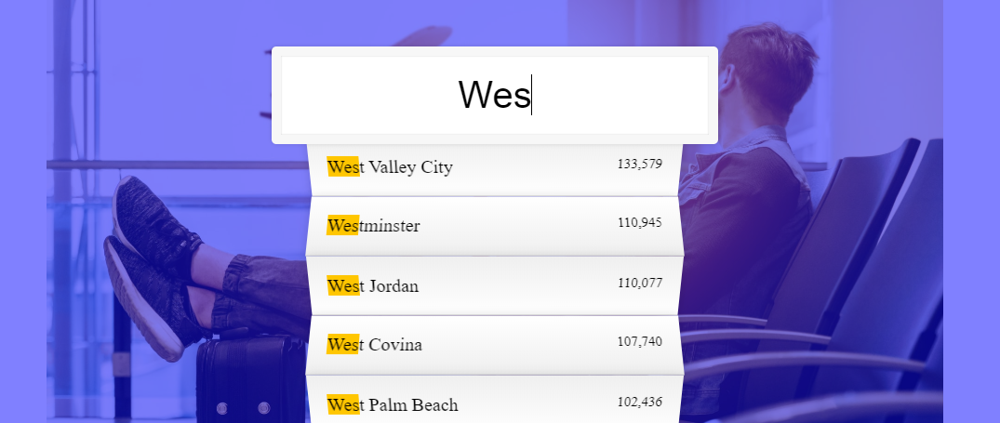

### JS TYPE AHEAD

https://javascript30.com

* User types in a city or state

* The typed input is checked letter by letter for matching string from the given endpoint

* whole matching output is displayed with matched section from input highlighted
